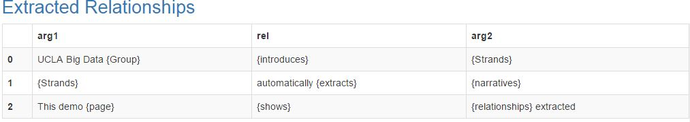

Story Analysis UI Demo
=======

The demo page is at http://big-data.ee.ucla.edu/demo/

This demo page is for entity relationship extraction. The user may input some texts in the textarea and get 
the entities and relationships in the texts by simply clicking the submit button. If any relationships found 
in the text, three tables will show up and display the extracted relationships, ranking of the extractions, 
and ranking of the entities respectively. To make the result vivid, a graph is developed to display the 
entities as nodes and relationships as links.     

The demo page for entity relationship extraction is developed with [Flask](http://flask.pocoo.org/docs/0.12/).  
The graph is implemented with [D3.v3.js](https://d3js.org/).

### Dependencies
* practnlptools can be downloaded from https://github.com/biplab-iitb/practNLPTools
```
	python setup.py install
```
* nxpd: 	
```
	sudo pip install nxpd
```
* nltk: 	
```
	sudo pip install nltk
	python -m nltk.downloader all
```
* nltk_data
```
	python
	>> import nltk
	>> nltk.download('punkt')
```
Move the nltk_data folder to /var/www or /usr/lib (or some other folder as long as the app can find it) 

* Flask 0.10.1 
```
	sudo pip install Flask
	sudo pip install flask_wtf
```


### Usage
* For local test:
```
	python run.py
```
See the webpage at http://localhost:5000

* To test on a server:
```
	python serve.py start | stop | restart
```

### Appearance

#### index page http://big-data.ee.ucla.edu/demo/:


#### table:


#### graph:
